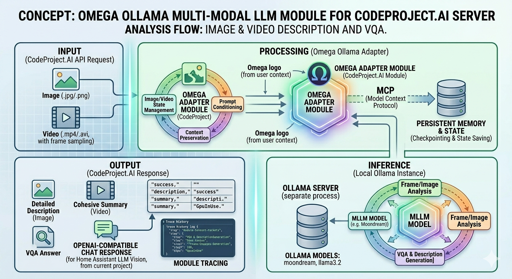

# CodeProject.AI – Ollama MultiModal LLM by OmegaIT



Plugin for [CodeProject.AI Server](https://www.codeproject.com/ai/) that uses **Ollama** for image and video description and visual question answering. Supports multiple vision models (default: Moondream) and video via frame sampling + summarization.

**Author:** Zlatko Lakisic · **OmegaIT LLC** · [omega-it.solutions](https://omega-it.solutions)  
**License:** [MIT with Attribution](LICENSE) — open source; derivative works must credit Zlatko Lakisic and OmegaIT LLC.

## Requirements

- **CodeProject.AI Server** installed and running.
- **Ollama** installed and running on the same machine (or reachable at `OLLAMA_HOST`).  
  - **Linux / Docker:** The installer can install Ollama **into the module folder** (per [manual install](https://docs.ollama.com/linux)) so it persists when the module lives on a volume. Binary: `module_dir/ollama/bin/ollama`; models: `module_dir/models`. Set `OLLAMA_MODELS` to the module’s `models` folder when starting Ollama at runtime.
  - **Windows:** The installer can install the [standalone CLI](https://docs.ollama.com/windows) (ollama-windows-amd64.zip) into the module folder (`module_dir\ollama`); models go to `module_dir\models`. Otherwise install from [ollama.com](https://ollama.com) and ensure `ollama` is in PATH.
- The **moondream** model pulled in Ollama (the installer does this automatically when Ollama is available).  
  For **video**, the same vision model is used to describe frames and to summarize; no second model is required. Optionally set **OLLAMA_SUMMARY_MODEL** to a different model (e.g. `llama3.2`) and run `ollama pull llama3.2` if you prefer a separate summary model.

## Installation

1. **Copy this folder into the folder the server scans for modules.**  
   On **Windows** (CodeProject.AI Server 2.9.x) the server uses **modules**, not “modules”:
   - **Path:** `C:\Program Files\CodeProject\AI\modules\OmegaOllamaMultiModalLLM\`
   - Copy the entire **OmegaOllamaMultiModalLLM** folder into that `modules` folder. (There is no AnalysisLayer on many installs.)

2. Run the CodeProject.AI setup so it installs the module:
   - **Windows:** Open an elevated (Administrator) command prompt, go to the module folder, then run the setup that targets this module. For example:
     ```bat
     cd "C:\Program Files\CodeProject\AI\modules\OmegaOllamaMultiModalLLM"
     ..\..\setup.bat
     ```
     (Or run the main Server setup from the AI folder if it installs all modules.)

3. The installer will:
   - **Linux:** If Ollama is not in the module folder, download and extract Ollama into `module_dir/ollama` (manual install per [docs.ollama.com/linux](https://docs.ollama.com/linux)); models go to `module_dir/models`. Optional: set `OLLAMA_USE_ROCM=1` for AMD GPU before install.
   - Create a Python virtual environment for the module (if needed).
   - Install dependencies from `requirements.txt` (ollama, Pillow, CodeProject-AI-SDK).
   - Start Ollama if needed and run `ollama pull moondream` (and `ollama pull llama3.2` for video).

4. **At runtime (Linux/Docker):** If Ollama was installed into the module folder, start it with the module’s models dir so models persist:
   ```bash
   OLLAMA_MODELS="$(pwd)/models" ./ollama/bin/ollama serve
   ```
   (Run from the module directory, or set `OLLAMA_MODELS` to the module’s `models` path.) If Ollama is in system PATH, just ensure it is running and `ollama pull moondream` has been run.

5. Enable and start the **Ollama MultiModal LLM by OmegaIT** module in the CodeProject.AI dashboard.

## Development

To run changes directly without copying the folder each time, you can **symlink** this repo into CodeProject.AI’s modules folder:

- **Windows (elevated/admin):**  
  From the CodeProject.AI `modules` folder (e.g. `C:\Program Files\CodeProject\AI\modules\`), create a directory junction or symlink named `OmegaOllamaMultiModalLLM` pointing to your clone of this folder (e.g. `D:\Projects\ollama-integrations\OmegaOllamaMultiModalLLM`).  
  CodeProject.AI will then load the module from your repo, so edits here take effect after restarting the module (or the server).

## Self-test

When the installer or dashboard asks for a self-test:

1. **Start the module** in the CodeProject.AI dashboard (enable and start **Ollama MultiModal LLM by OmegaIT** if it isn’t already).
2. **Run the test** in one of these ways:
   - **Explorer:** Open the CodeProject.AI Explorer (e.g. from the dashboard), go to the Vision section, and use the **Ollama MultiModal** test if it appears there.
   - **Test page:** In your browser go to  
     `http://localhost:32168/explore/OmegaOllamaMultiModalLLM`  
     (or the URL shown in the dashboard for this module’s explore page). Upload an image, optionally enter a prompt, and click **Describe image**. You should see the model’s description or an error message.
   - **API:** From a terminal:  
     `curl -X POST "http://localhost:32168/v1/vision/omega-ollama/describe-image" -F "image=@path/to/image.jpg"`  
     and check the JSON response for `"success": true` and a `"description"` field.

If the module is running and Ollama has the moondream model, the self-test should return a short description of the image.

**Module not showing in the dashboard?** Side-loaded modules (like this one) may appear under **Settings** → **Modules**, or in an **Installed** / **Local modules** list rather than in the main “Install modules” catalog. Refresh the page, restart CodeProject.AI Server if needed, and confirm the folder **OmegaOllamaMultiModalLLM** is in the server’s **modules** directory (e.g. `C:\Program Files\CodeProject\AI\modules\`). Then restart the server and refresh the dashboard. The module appears as **Ollama MultiModal LLM by OmegaIT** (OmegaOllamaMultiModalLLM).

## Home Assistant: LLM Vision (HACS)

This module exposes an **OpenAI-compatible** endpoint so [LLM Vision](https://github.com/valentinfrlch/ha-llmvision) can use CodeProject.AI directly.

1. **Ensure the module is running** (Ollama MultiModal LLM by OmegaIT enabled and started in the CodeProject.AI dashboard).

2. **In Home Assistant:** Settings → Devices & services → LLM Vision → Add Entry (or Reconfigure). Choose **OpenAI** or **Custom OpenAI** (OpenAI-compatible). Set:
   - **Base URL:** Your CodeProject.AI server URL, **with no path** (e.g. `http://codeproject-ai:32168` or `http://192.168.1.10:32168`). LLM Vision will call `/v1/chat/completions` on that base.
   - **API key:** Leave empty or use any placeholder (this endpoint does not require a key).
   - **Model:** Any label (e.g. `omega-ollama`); the module uses your configured vision model.

3. Use this provider in LLM Vision for camera snapshots, Frigate events, etc. Requests go to CodeProject.AI’s **Ollama MultiModal LLM** module.

**Endpoint:** `POST /v1/chat/completions` — accepts JSON in OpenAI chat format (e.g. `messages` with `image_url` and text) and returns OpenAI-style `choices` with the vision description.

## API

- **Image:** `POST /v1/vision/omega-ollama/describe-image`
  - **Inputs:** `image` (file, required), `prompt` (string, optional).
- **OpenAI-compatible (LLM Vision):** `POST /v1/chat/completions`
  - **Inputs:** JSON body with `messages` (array with `image_url` + text) and optional `model`. Returns OpenAI-style `choices` with the vision description.
- **Video:** `POST /v1/vision/omega-ollama/describe-video`
  - **Inputs:** `video` (file, required), `prompt` (string, optional).
  - **Outputs:** `success` (boolean), `description` (string), `error` (string when failed). Same shape as describe-image; processing is synchronous (may take 1–2 minutes for several frames).

Example (image):

```bash
curl -X POST "http://localhost:32168/v1/vision/omega-ollama/describe-image" \
  -F "image=@/path/to/image.jpg" \
  -F "prompt=What is in this image?"
```

Example (video):

```bash
curl -X POST "http://localhost:32168/v1/vision/omega-ollama/describe-video" \
  -F "video=@/path/to/clip.mp4" \
  -F "prompt=Describe this image in a few sentences."
```

## Configuration

- **Vision model (dashboard):** In the module’s configuration in the CodeProject.AI dashboard, use the **Vision model** menu to choose which Ollama vision model to use. Default is **Moondream** (small, fast). Options include LLaVA 7B/13B/34B, Llama 3.2 Vision 11B/90B, and others. Ensure the chosen model is pulled (`ollama pull <model>`).
- **Environment variable:** `OLLAMA_VISION_MODEL` – Ollama vision model name (default: `moondream`). Set in the module’s environment or in `modulesettings.json` under `EnvironmentVariables`; the dashboard menu overrides this when set.
- **OLLAMA_SUMMARY_MODEL** – Optional. Model used to summarize video frame descriptions into one text. If unset, the **vision model** (e.g. Moondream) is used for both describing frames and summarizing, so one model is enough. Set to e.g. `llama3.2` and run `ollama pull llama3.2` if you want a separate summary model.
- **OLLAMA_VIDEO_INTERVAL_SEC** – For video: sample one frame every N seconds (default: `5`). Larger values = fewer frames and faster requests.
- **OLLAMA_VIDEO_MAX_FRAMES** – Maximum number of frames to analyze per video (default: `6`). Keep low so the request finishes within the server’s HTTP timeout (e.g. 4–6 frames).

**Video:** The module uses OpenCV (`opencv-python-headless`) to extract frames from video files. Supported formats include .mp4, .avi, .mov, .mkv, .webm. Frames are sampled at the configured interval, each frame is described with the vision model, then the text model summarizes. Processing is synchronous; use conservative frame count/interval to avoid server timeouts.

## GPU

- **Where inference runs:** Image inference runs in the **Ollama** server process (a separate process from this module). Ollama uses the GPU automatically when CUDA is available; this module only sends requests to Ollama and does not run the model itself.
- **Enable/Disable GPU button:** The dashboard’s GPU toggle is respected: when **Enable GPU** is on and the system has an NVIDIA GPU (or PyTorch with CUDA), the module reports **GPU** as the inference device so the dashboard shows correct status. When the toggle is off, the module reports **CPU**. The actual GPU use is still determined by the Ollama server.
- **Verifying GPU use:** To confirm Ollama is using the GPU, run:
  ```bash
  ollama ps
  ```
  The **PROCESSOR** column should show e.g. `100% GPU` when a model is loaded. The module’s status (in the dashboard or API) may also include `ollamaGpuInUse: true` when Ollama reports VRAM usage for loaded models.

## Troubleshooting

- **“Access is denied” / “Unable to install Python 3.10”:** The CodeProject.AI installer needs to download Python and write to its install folder (e.g. `C:\Program Files\CodeProject\AI\`). Fix it by either:
  1. **Run the installer as Administrator:** Right‑click `setup.bat` (or the shortcut that runs setup) → **Run as administrator**, then run module install again from the dashboard or setup.
  2. **Use a user-writable install path:** Install CodeProject.AI Server to a location where your user has full rights (e.g. `C:\CodeProject\AI` or a folder under your user profile) so the installer can create `downloads`, `runtimes`, and module venvs without elevation.
- **Module won’t start:** Ensure Python 3.10+ and the module’s venv are set up (re-run setup as above). If you **copied** this folder from another path (e.g. after renaming from OllamaVision), the copied `bin` folder may have an invalid venv; delete the `bin` folder and run setup again so it creates a fresh virtual environment.
- **“Connection refused” or no response:** Ensure Ollama is running (`ollama list` should work) and that the host/port match (default `http://localhost:11434`; use `OLLAMA_HOST` if needed).
- **Model not found:** Run `ollama pull moondream` (and optionally set `OLLAMA_VISION_MODEL` if you use a different model name).
- **Module not visible in dashboard:** The server loads modules from **modules**, not from “modules”. Put the **OmegaOllamaMultiModalLLM** folder at `C:\Program Files\CodeProject\AI\modules\OmegaOllamaMultiModalLLM\`, then restart the server and refresh the dashboard. See **Module not showing in the dashboard?** under Self-test above. The module appears as **Ollama MultiModal LLM by OmegaIT** (OmegaOllamaMultiModalLLM).
- **describe-video returns “The request timed out”:** Video processing is synchronous and does several Ollama calls (one per frame plus summary). If the server’s HTTP timeout is short (e.g. 60–120s), reduce work: set `OLLAMA_VIDEO_MAX_FRAMES=4` and `OLLAMA_VIDEO_INTERVAL_SEC=8` in the module’s environment. Alternatively increase the server’s request timeout if supported. **Note:** An async (long-running) mode was reverted because the current CodeProject.AI Server throws an unhandled exception when it receives a “Command is running in the background” response; video is therefore synchronous until the server supports that response shape.
